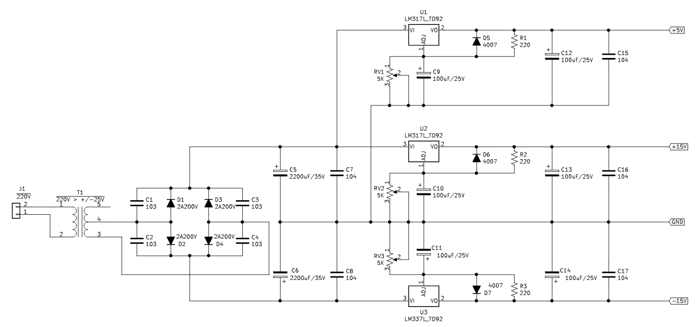
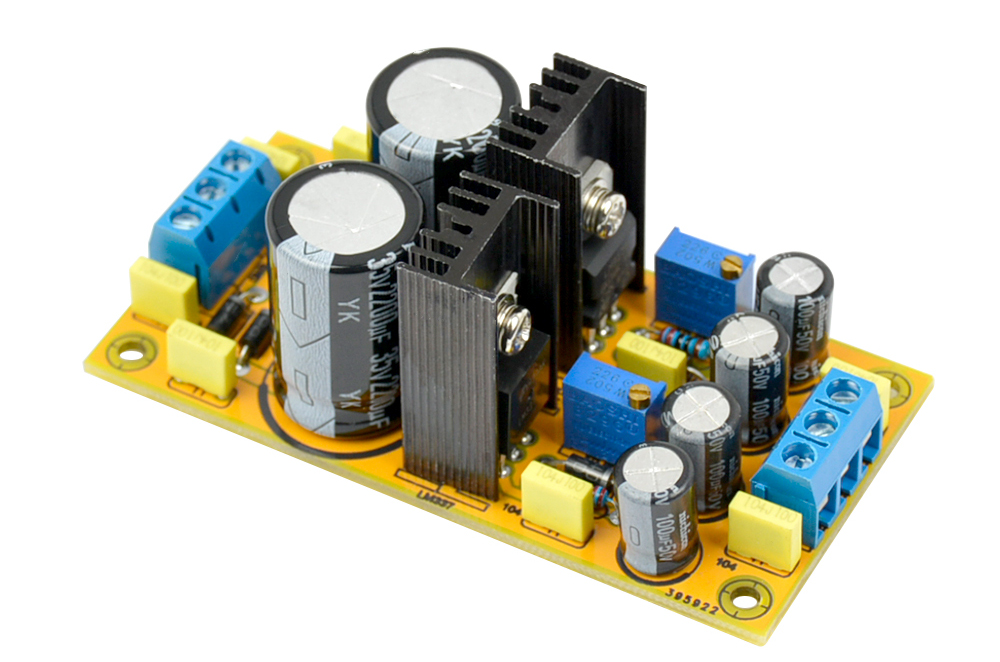

# 1001 - Power Unit - +15V / -15V / +5V - 1A

Adjustable Regulated Power Unit Module

- voltages : +15V/-15V/+5V/GND
- Current  : 1A by channel

## Schematics

## Realization

From : [aliexpress](https://www.aliexpress.com/item/32821562439.html?spm=a2g0s.9042311.0.0.27424c4dz3ouM9)